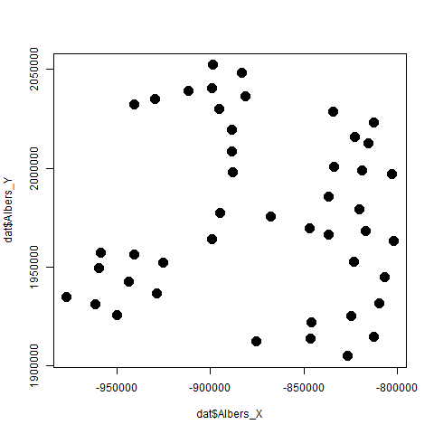

<style type="text/css">
.main-container {
  max-width: 1800px;
  margin-left: auto;
  margin-right: auto;
}
</style>

<style type="text/css">
  body{
  font-size: 14pt;
}
</style>

## **Context**

Using survey data from 2022,  I fit a spatial occupancy model to predict occurence

```{r setup, include=FALSE}
# Set Environment and load objects
  knitr::opts_chunk$set(echo = TRUE)
  load("../outputs/data.for.modeling")
```

## **2022 Survey**

### Summary Information

- The number of sampled cells: `r nrow(dat)`
- The number of data columns: `r ncol(dat)`

### Table

The number of cells selected for sampling and that were surveyed: 
```{r table, fig.height=4,echo=FALSE}
  knitr::kable(table(dat$Surveyed2022))
```


## **Results**

The plotted spatial locations are




## **References**

Johnson, D. S., Conn, P. B., Hooten, M. B., Ray, J. C., \& Pond, B. A. (2013). Spatial occupancy models for large data sets. Ecology, 94, 801-808.
