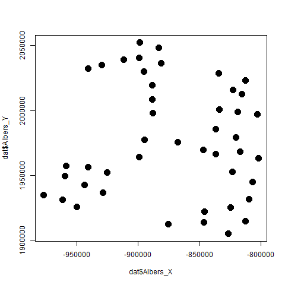

## **Context**

Using survey data from 2022,  I fit a spatial occupancy model to predict occurence

## **2022 Survey**

### Summary Information

- The number of sampled cells: 45
- The number of data columns: 21

### Table

The number of cells selected for sampling and that were surveyed: 

|Var1 | Freq|
|:----|----:|
|No   |   29|
|Yes  |   16|

## **Results**

The plotted spatial locations are

## **References**

Johnson, D. S., Conn, P. B., Hooten, M. B., Ray, J. C., \& Pond, B. A. (2013). Spatial occupancy models for large data sets. Ecology, 94, 801-808.
